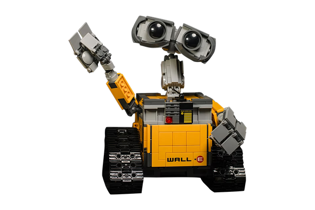

# Chatter-Docs

This project is an implementation of a *Retrieval Augmented Generation* (RAG) System. It uses a RAG from scratch with an SQLite vector database and the API from OpenAI to create an interactive chat experience with one or more PDFs supplied by the user. Inspiration drawn from https://github.com/architkaila/Chat-With-Documents.



## Overview

1. **Upload Your Documents**: Users can upload one or more PDF(s) directly into the Streamlit app. 
2. **Text Preparation**: Once uploaded, the app extracts the text from the document(s) and splits into chunks. There are settings related to chunk size and overlap for newly imported documents. 
3. **Embedding and Indexing**: The chunked text is then embedded using OpenAI embeddings and saved to a SQLite database. 
4. **Streawmlit Interface**: Users can then navigate to the chat section of the app, where they can ask questions and engage in dialogue with the RAG-empowered chatbot. The embedded documents serve as the context needed to generate accurate and contextually relevant responses. There are two columns, the one on the left for the RAG-empowered chatbot, and the one on the right to show a direct call to the GPT API for responses for comparison.


&nbsp;
## Running the Application 
Following are the steps to run the StreamLit Application: 

**1. Create a new conda environment and activate it:** 
```
conda create --name chat python=3.8.17
conda activate chat
```
**2. Install python package requirements:** 
```
pip install -r requirements.txt 
```
**4. Add OpenAI API Key**
```
- Copy the `env.example` file and rename the copy to `.env`.
- Open the `.env` file and replace `your_api_key_here` with your actual OpenAI API key.
```
**5. Run the application**
```
streamlit run app.py
```


## Directory Structure

```
.
├── Dockerfile
├── README.md
├── __pycache__
│   ├── my_rag.cpython-38.pyc
│   └── my_rag.cpython-39.pyc
├── app.py
├── assets
│   ├── output_file.txt
│   ├── output_file2.txt
│   ├── question_doc.txt
│   └── robot-image.png
├── data
│   ├── db_file.db
│   ├── empty.txt
│   └── pdfs
│       ├── 1411.2738.pdf
│       ├── I need a procedure - DukeRads.pdf
│       ├── Manual on MR Safety.pdf
│       ├── Visage7_Client_OnlineHelp_EN_V11.pdf
│       ├── Watch-and-Wait Approach to Rectal Cancer Radiology 2023.pdf
│       └── s41586-023-06747-5.pdf
├── directory_tree.txt
├── env.example
├── my_rag.py
├── notebooks
│   ├── process_question_list.ipynb
│   └── starter.ipynb
└── requirements.txt


